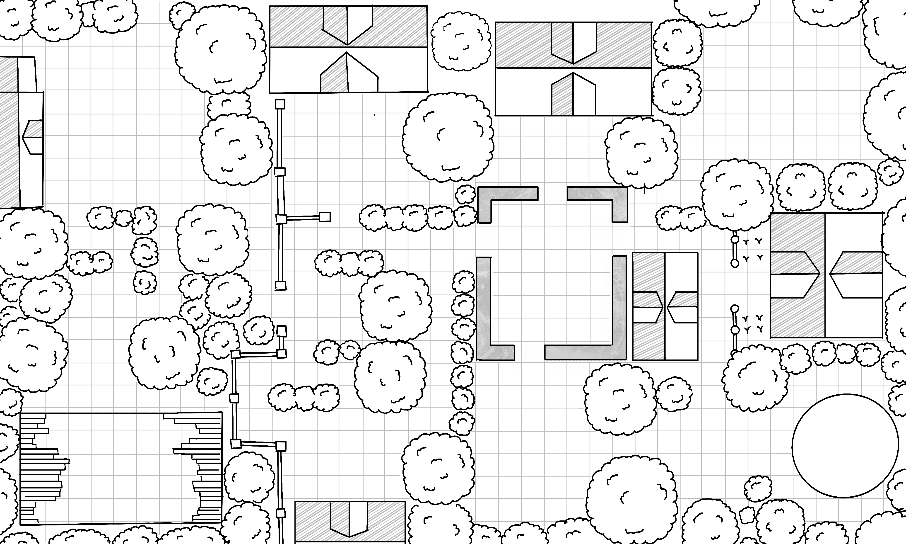

# Whisker's Hollow

### Spec

- **Width:** 40"
- **Height:** 24"
- **Resolution:** 100ppi
- **Print Orientation:** Landscape
- **Enter:** Bottom Left
- **Exit:** Bottom Right

### Design

- Whisker's hollow is the primary setting of "The Kight, the Thief, and the Wizard."
- Gates limit movement between sections.
- The players finish in the tower in the bottom right corner.
